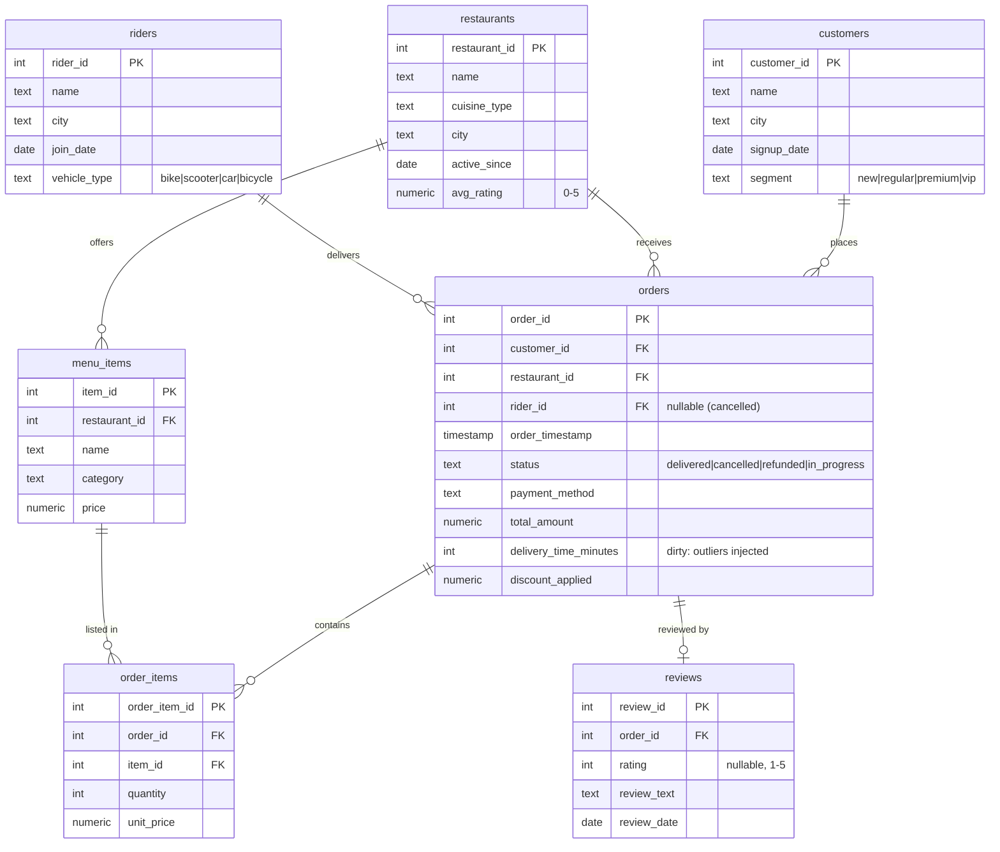

# FoodHub Analytics — Entity Relationship Diagram

Normalized (3NF) schema for a food-delivery platform. Seven tables: four core
dimensions (`customers`, `restaurants`, `riders`, `menu_items`), a central
`orders` fact, its `order_items` detail, and `reviews`.

## Relationship notes
- **customers → orders** (1:N): one customer places many orders.
- **restaurants → orders** (1:N): one restaurant fulfils many orders.
- **restaurants → menu_items** (1:N): a menu item belongs to exactly one restaurant.
- **riders → orders** (1:N, optional): `rider_id` is nullable because cancelled
  orders may never be assigned a rider.
- **orders → order_items** (1:N): an order has 2–4 line items on average.
- **menu_items → order_items** (1:N): an item appears across many orders.
- **orders → reviews** (1:0..1): each delivered order may have at most one review.
