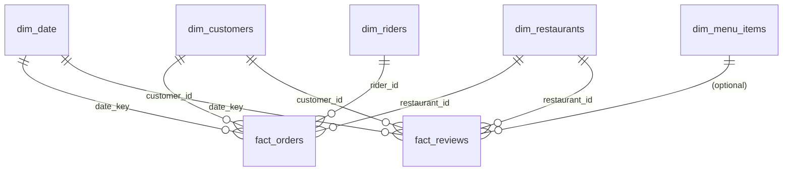

# Power BI Desktop — Build Guide

This is the **manual GUI step**. Everything upstream (schema, data, cleaning,
views, DAX) is done — this guide takes you from an empty Power BI Desktop file to
a 4-page dashboard. Budget ~60–90 minutes.

Prerequisite: the database is loaded and the views in `sql/04_powerbi_views.sql`
exist (run the load pipeline first — see project `README.md`).

---

## 1. Connect to PostgreSQL

1. Open **Power BI Desktop** → **Home → Get Data → More… → Database → PostgreSQL database**.
2. **Server:** `localhost`  **Database:** `foodhub`  → **OK**.
   - If prompted for a Npgsql provider, install it (Power BI will link you).
3. **Data Connectivity mode:** choose **Import** (dataset is small; import is fastest).
4. Sign in with your **Database** credentials (user `postgres`, your password).
5. In the **Navigator**, tick these **views** only (not the raw tables):
   - `fact_orders`
   - `fact_reviews`
   - `dim_customers`
   - `dim_restaurants`
   - `dim_riders`
   - `dim_menu_items`
   - `dim_date`
6. Click **Load**.

> Importing the *views* (not tables) means the cleaning/denormalization already
> happened in SQL — Power BI just consumes a clean star.

---

## 2. Model — relationships

Go to **Model view** (left rail). Power BI may auto-detect some relationships;
verify/create these. All are **one-to-many**, single cross-filter direction
**from the dimension to the fact**, unless noted.

Create relationships (drag the field from the dim onto the matching field in the fact):

| From (one) | Field | To (many) | Field | Notes |
|---|---|---|---|---|
| `dim_date` | `date_key` | `fact_orders` | `date_key` | Primary date relationship (active) |
| `dim_customers` | `customer_id` | `fact_orders` | `customer_id` | |
| `dim_restaurants` | `restaurant_id` | `fact_orders` | `restaurant_id` | |
| `dim_riders` | `rider_id` | `fact_orders` | `rider_id` | **Cancelled orders have blank rider_id** — leave "Assume referential integrity" **unchecked** |
| `dim_date` | `date_key` | `fact_reviews` | `date_key` | |
| `dim_customers` | `customer_id` | `fact_reviews` | `customer_id` | |
| `dim_restaurants` | `restaurant_id` | `fact_reviews` | `restaurant_id` | |

Then:
1. Select **`dim_date`** in the Fields pane → **Table tools → Mark as date table** →
   choose `date_key`. (Required for the time-intelligence DAX.)
2. Hide foreign-key columns on `fact_orders` from report view (right-click → Hide)
   to keep the field list clean: `customer_id`, `restaurant_id`, `rider_id`, `date_key`.

---

## 3. Add the measures

Create a blank measure table to hold them:
- **Home → Enter Data** → leave empty, name it `_Measures` → Load.
- Select `_Measures`, then **Modeling → New Measure** and paste each block from
  [`dax_measures.md`](./dax_measures.md), one at a time.

Set formatting as you go: `Total Revenue`, `AOV`, etc. → currency/whole number;
`On-Time Delivery %`, `Cancellation Rate %`, `Revenue MoM %`, `Repeat Rate %` →
Percentage (1 decimal).

---

## 4. Page layout (4 pages)

Rename pages at the bottom tab bar. Suggested visuals per page:

### Page 1 — Executive Overview
| Zone | Visual | Fields / Measures |
|---|---|---|
| Top KPI row (cards) | 5× Card | `Total Revenue`, `Delivered Orders`, `Average Order Value`, `Active Customers`, `On-Time Delivery %` |
| Trend | Line chart | Axis `dim_date[year_month]`, Value `Total Revenue`; add `Revenue MoM %` as line on secondary axis |
| Mix | Donut | Legend `fact_orders[payment_method]`, Value `Delivered Orders` |
| Geo | Clustered bar | Axis `dim_restaurants[city]`, Value `Total Revenue` |
| Slicers | 2× Slicer | `dim_date[year]`, `dim_restaurants[city]` |

### Page 2 — Customer Analytics / RFM
| Zone | Visual | Fields / Measures |
|---|---|---|
| KPI row | 3× Card | `Active Customers`, `Repeat Rate %`, `Revenue per Customer` |
| RFM segments | Clustered bar or Treemap | Axis `dim_customers[segment]` (or imported RFM segment), Value `Customers in Segment` and `Total Revenue` |
| Cohort retention | Matrix | Rows = cohort month, Columns = month offset, Values = retention % (import the `sql/queries/04` retention output as a view/table, or build with the New/Returning measures) |
| New vs returning | Stacked column | Axis `dim_date[year_month]`, Values `New Customers`, `Returning Customers` |
| Slicer | Slicer | `dim_customers[segment]` |

> Tip: to get a true cohort matrix, add a view wrapping
> `sql/queries/04_cohort_and_retention` Q2 and import it as its own table.

### Page 3 — Operational Performance
| Zone | Visual | Fields / Measures |
|---|---|---|
| KPI row | 4× Card | `Avg Delivery Time`, `On-Time Delivery %`, `Cancellation Rate %`, `Valid Deliveries` |
| Speed by city | Bar | Axis `dim_restaurants[city]`, Value `Avg Delivery Time` |
| SLA by vehicle | Clustered column | Axis `dim_riders[vehicle_type]`, Values `On-Time Delivery %`, `Avg Delivery Time` |
| Peak hours | Column | Axis `hour` (add `HOUR` column on fact or use order_timestamp), Value `Total Orders` |
| Rider leaderboard | Table | `dim_riders[rider_name]`, `Valid Deliveries`, `Avg Delivery Time`, `On-Time Delivery %` |

### Page 4 — Restaurant Performance
| Zone | Visual | Fields / Measures |
|---|---|---|
| KPI row | 3× Card | `Total Revenue`, `Avg Rating`, `Total Items Sold` |
| Top restaurants | Bar | Axis `dim_restaurants[restaurant_name]`, Value `Total Revenue` (Top-15 filter) |
| Revenue by cuisine | Treemap | Group `dim_restaurants[cuisine_type]`, Value `Total Revenue` |
| Rating vs revenue | Scatter | X `Avg Rating`, Y `Total Revenue`, Details `restaurant_name` |
| Best-selling items | Table | `dim_menu_items[item_name]`, `Total Items Sold` |

---

## 5. Polish (optional, if time)
- Apply a consistent theme: **View → Themes** → pick one (or import a JSON theme).
- Add a title textbox per page and a slicer sync (**View → Sync slicers**) so
  `year`/`city` filters carry across pages.
- Format all `%` measures and add data labels to KPI cards.

## 6. Save & publish
- **File → Save As** → `powerbi/foodhub_dashboard.pbix` (kept out of git via
  `.gitignore` if large; export screenshots to `docs/` for the README/case study).
- Optionally **Publish** to the Power BI Service for a shareable link.

---

### Refreshing after data changes
Re-run `data/generate_data.py` + the load pipeline, then in Power BI:
**Home → Refresh**. The views absorb schema-stable changes automatically.
